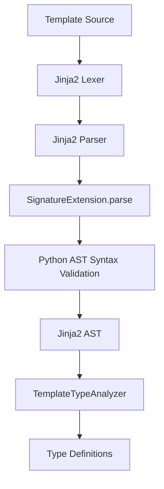

# Architecture of `jinja2-type-gen`

`jinja2-type-gen` operates as a static analysis tool that integrates deeply with the Jinja2 parsing pipeline. Its goal is to extract type metadata from custom template tags without impacting the template's runtime execution.

## Data Flow Pipeline

The architecture is divided into three primary phases: Lexing & Parsing (via Jinja2 Extension), AST Transformation, and Output Generation.

### 1. Extension parsing (`SignatureExtension`)

- **Action:** Hooks into Jinja2's parser on encountering `` tags.
- **Mechanism:** Iteratively consumes the token stream to build a raw string representation of the python signature.
- **Safety Boundary:** The extension validates the syntax using python's native `ast.parse` at compilation time. If the syntax is malformed, it immediately throws a `TemplateSyntaxError`.
- **Zero Runtime Cost:** The metadata is attached to an empty Jinja `nodes.Output` node, ensuring it evaluates to nothing and executes no code at runtime.

### 2. AST Transformation & Analysis (`TemplateTypeAnalyzer`)

- **Action:** Performs a linear-time static traversal of the Jinja2 AST.
- **Mechanism:** It operates iteratively (using a queue and stack) to avoid `RecursionError` on deeply nested ASTs.
- **Inclusion Resolution:** Correctly bubbles up variables from inherited templates (`extends`) and partials (`include`). Local variables in `macro` scopes are deliberately ignored.
- **Type Extraction:** Parses the native python `ast.FunctionDef` structure to reliably identify variable names, types, and defaults (required vs. optional).

### 3. Output Generation (`cli.py`)

- **Action:** Converts the analyzed metadata into PEP 589 `TypedDict` stubs (`.pyi`).
- **Render Shim Generation:** Can optionally emit type-safe render wrapper functions that encapsulate `Unpack[Context]` to force IDEs to evaluate template arguments statically.
